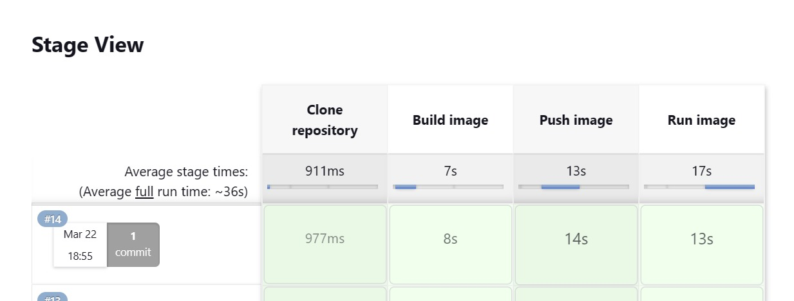
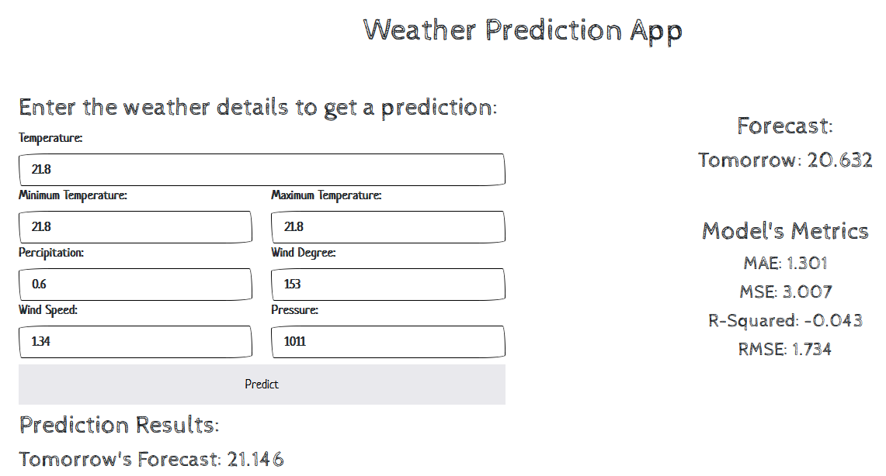
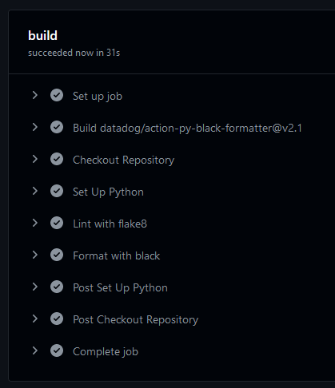

# Introduction
A simple Flask application which gives tommorow's weather forecast for Islamabad based on current weather.

# Screenshots
|  |
| :--: |
| *Jenkins* |

|  |
| :--: |
| *Weather App* |

|  |
| :--: |
| *GH Actions* |

# Contributors
* [Hamza Iftikhar i192003](https://github.com/hmzaiftkhar)
* [Hamza Khalid i192011](https://github.com/hmzakhalid)
